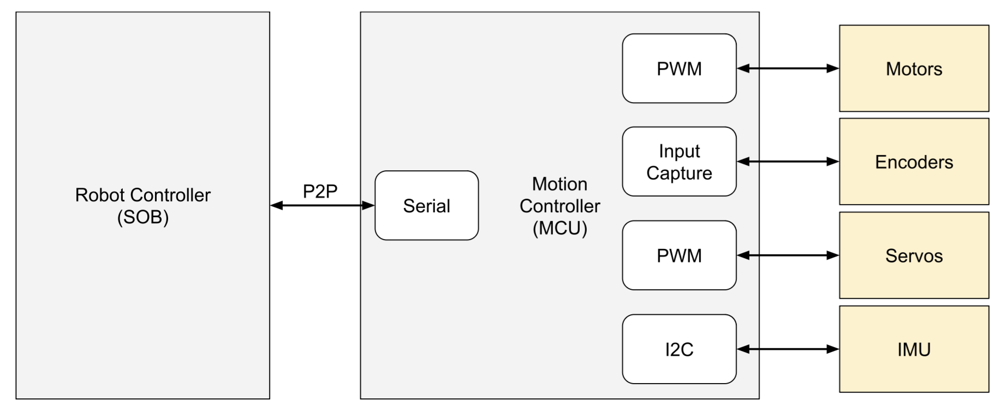

# Hotdog Fernando

Hotdog Fernando is a robotics platform for companion robots with emtional intelligence.

## HF1

HF1 is the first robot in the HF series. With your support, I will turn the prototype you see [here](https://www.ignaciomellado.es/hf1) into a product that you and your family can use too to learn robotics, play games, have fun together and other exciting stuff that's still cooking. Think of it as a fun pet minus the inconvenience (yes, that meant "poop").

By joining the [waitlist](https://www.ignaciomellado.es/hf1), you will get important project updates in your inbox: new features, launch dates, calls for pre-orders and crowdfunding campaigns, key milestones... I promise to not email you too often. You can also follow me on [X](https://x.com/uavster) or [Bluesky](https://bsky.app/profile/uavster.bsky.social) for more frequent updates on the project.

## Motion Controller

This repository is the software that runs on the HF1's Motion Controller: an Arduino-based board responsible for the low-level control and motion primitives. We have open-sourced the code for all makers and roboticists to play with and create a foundation for robot companions.

The main purpose of the Motion Controller is interfacing in real time with sensors and actuators, and enabling controlled motions commanded by the Robot Controller. The Robot and Motion Controllers communicate via a serial connection over a point-to-point protocol (P2P).

The motion controller performs the following functions:

**Hardware interfacing**
* Configuring and reading the IMU via I2C.
* Generating PWM signals for the wheel motors 
* Capturing the times when the wheel encoders change their state as they rotate
* Generating PWM signals for the head servos

**Motion control**
* Low-level control of the rotation speed of each wheel.
* Mid-level control of the base’s linear and angular velocities
* High-level control of the trajectories of the base and head.

The source code is split across three directories:
* *arduino*: Arduino project running on the Motion Controller. So far, only the Teensy 3.2 board is supported.
* *linux*: library with components necessary to create the corresponding communication endpoint on the Robot Controller. So far, only Linux is supported.
* *common*: multi-platform library with code common to both the Arduino and Linux endpoints; mainly, utilities and the P2P communication core.

